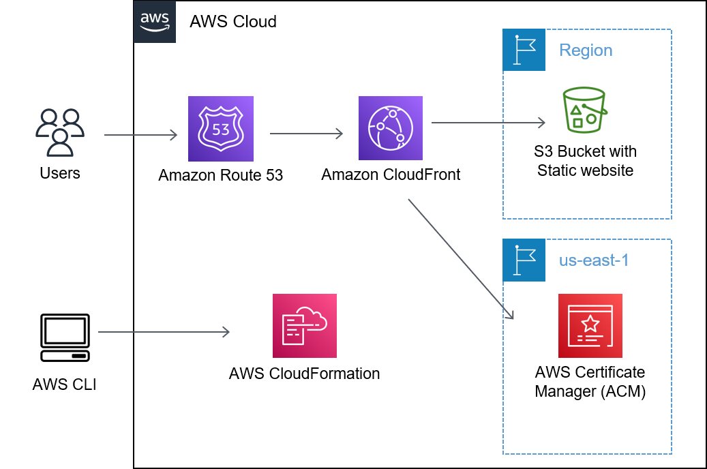

# Static Website

The main goal of this lab is to familiarize with the AWS environment and create a basic HTTP static website.

## Tools and components

This lab uses the following tools and components:

- AWSCLI
- CloudFormation
- S3
- Route53
- CloudFront

## Setup

Clone this repository.

The following scripts will create a Stack in CloudFormation which:

- Create a S3 Bucket
- Create a Cloud Front Access Identity
- Create a Cloud Front Distribution which uses the certificate and the Cloud Front Access Identity
- Set the permission to access the S3 bucket only over the Cloud Front Access Identity
- Add a DNS entry in route53 which resolves your URL to the cloud front distribution public URL

## Deployment

Open the file static_website_stack.yml and change the Parameter Values (default):

- BucketName= _this must be a unique name_
- DomainName= _URL of your website_
- CertificateARN= _ARN of your certificate, that you will find in AWS Certificate Manager_

And then, in the console:

> make deploy

## Test

Browse to the URL you defined as DomainName (with https://)

## Cleanup

In the console:

> make clean

Manual tasks to do, after the cleanup is completed:

- delete certificate in ACM
- delete Hosted Zone in Route53

## Many many thanks to

- https://coletiv.com/blog/how-to-use-aws-cloud-formation-to-setup-the-infrastructure-for-a-static-website/
- https://medium.com/swlh/aws-website-hosting-with-cloudformation-guide-36cac151d1af
- https://advancedweb.hu/how-to-test-with-a-live-domain-name-for-free/
- https://adamtheautomator.com/aws-s3-static-ssl-website/
