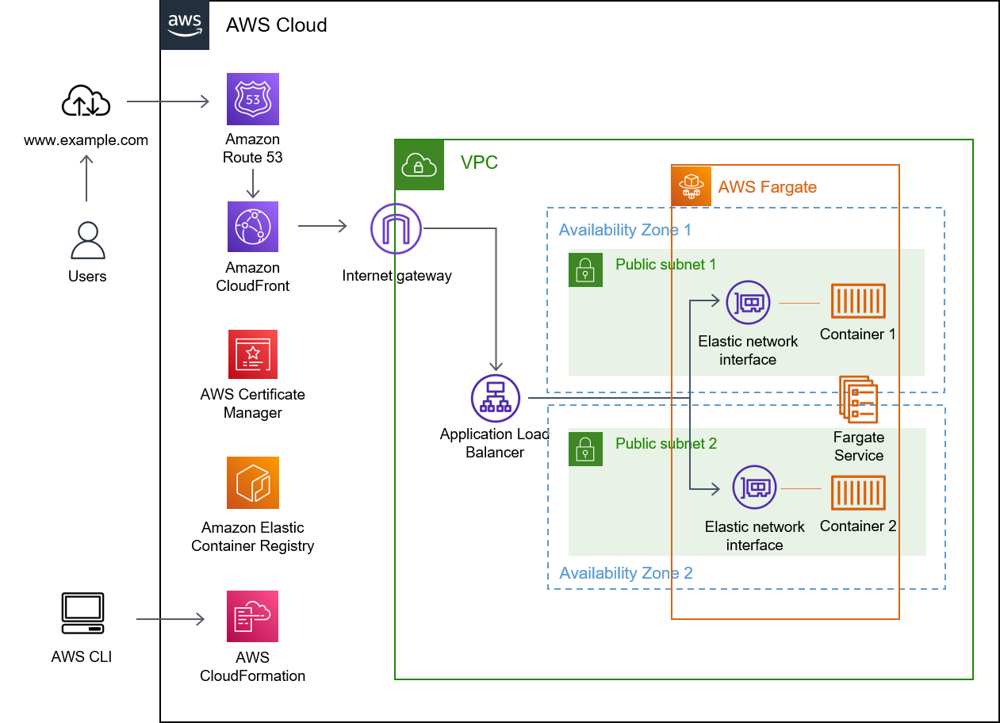

# Fargate

The main goal of this lab is to familiarize with the AWS environment and deploy a simple web application on Fargate.

## Tools and components

This lab uses the following tools and components:

- AWSCLI
- CloudFormation
- Route53
- CloudFront
- ECS (Elastic Container Service) on Fargate
- ECR (Elastic Container Registry)
- VPC (Virtual Private Cloud)
- ELB (Elastic Load Balancer)

## Prerequisites

you need to have docker installed on your local machine
you need to creste the role ecsTaskExecutionRole in IAM:
https://docs.aws.amazon.com/AmazonECS/latest/developerguide/task_execution_IAM_role.html

## Setup

Clone this repository.

The following scripts will create a Stack in CloudFormation which:

- Creates a container registry
- Pushes a simple nginx image to this registry
- Creates a ECS cluster on Fargate
- Creates a ECS task
- Creates a VPC with two subnets, an internet gateway, two route tables
- Creates a security group for the containers and a security group for the application load balancer (ALB)
- Creates an ALB with a target group and a listener
- Creates a service which runs the task and link the ALB over the target group

The creation of the Route53 record and the cloudformation distribution have to be done manually.

## Deployment

Open the file config.mk and change the Parameter Values (default):

- AWS_STACK_NAME= name of your stack
- AWS_IMAGE_NAME= name of your image in the ECR registry
- AWS_REGION=eu-west-3
- AWS_ACCOUNT_ID= id of your AWS Account

And then, in the console:

> make deploy

### configure DNS lookup, add a cloudformation distribution and link to the certificate

As of the 16.12.2021, custom origins are not supported in Cloudformation.

In order to redirect your URL to cloud front, you have to :

1. create a cloud front distribution
   Origin Domain: choose your ALB
   Protocol: HTTP only
   Viewer Protocol policy: redirect HTTP to HTTPS
   Allowed HTTP methods: GET, HEAD, OPTION
   Alternate Domain Name (CName): enter your domain name. In my case: lab.donato.cloudns.ph
   Custom SSL Certificate: choose your certificate in the list
   Let all the other values as default.

2. create a DNS entry in Route53 -> hosted zone > your hosted domain
   select create record
   Record Type: A
   click on "Alias"
   Choose endpoint: alias to cloudfront distribution
   Choose distribution: select your distribution
   click "create records" and wait about 3 minutes

## Test

Browse to the URL you defined as DomainName
In my case: https://lab.donato.cloudns.ph

## Cleanup

In the console:

> make clean

Manual tasks to do, after the cleanup is completed:

- delete certificate in ACM
- delete Hosted Zone in Route53

## Many many thanks to

- https://medium.com/@msahinkarademir/how-to-create-an-aws-ecs-fargate-cluster-for-our-web-applications-b387611dd7e6
- https://medium.com/@arliber/aws-fargate-from-start-to-finish-for-a-nodejs-app-9a0e5fbf6361
- https://mydeveloperplanet.com/2021/10/12/how-to-deploy-a-spring-boot-app-on-aws-fargate/
- https://mydeveloperplanet.com/2021/10/26/how-to-create-an-aws-cloudformation-fargate-template/
- https://github.com/nathanpeck/aws-cloudformation-fargate
